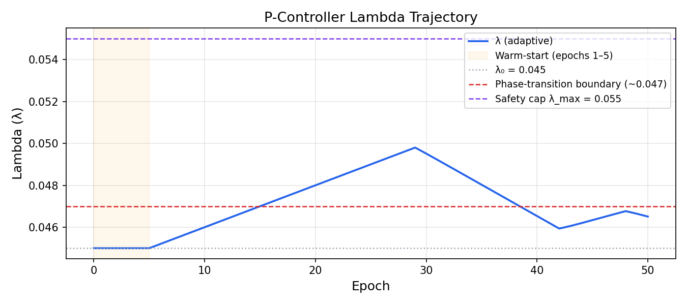
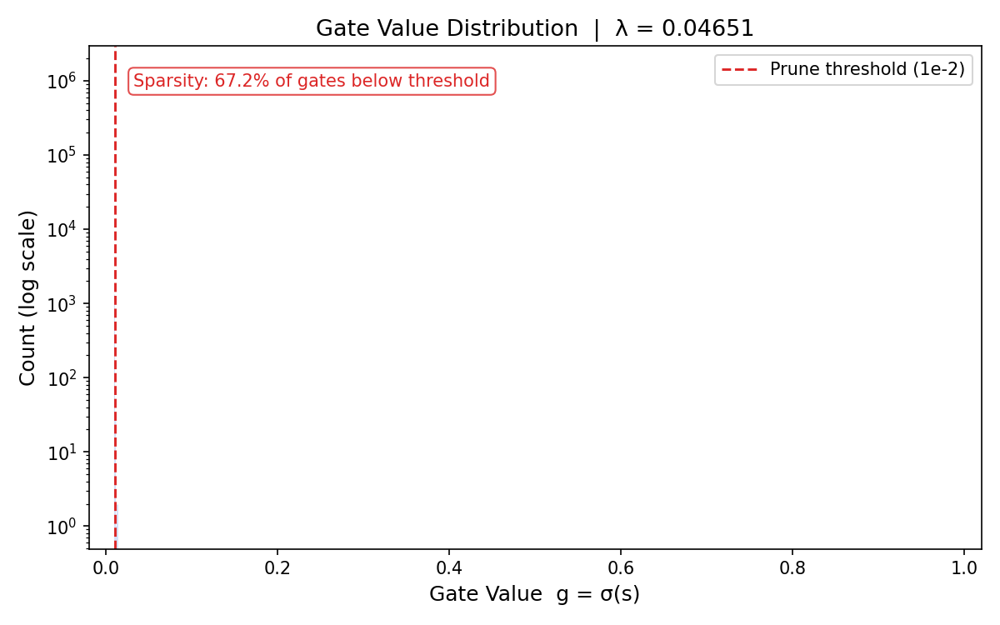
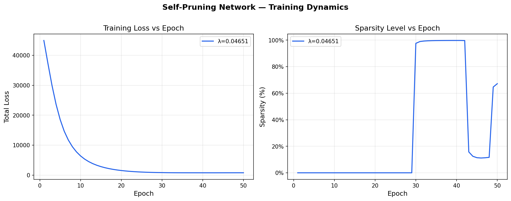

# Adaptive Differentiable Pruning — CIFAR-10

**Tredence AI Engineering Internship Case Study**  
**Author:** Aditya — M.Tech Cloud Computing, SRMIST  
**Hardware:** Apple Silicon (MPS) · **Framework:** PyTorch 2.x · **Python:** 3.11+

---

## Abstract

This project implements an **Adaptive Differentiable Pruning** framework for a feed-forward neural network trained on CIFAR-10. The central engineering contribution is not the pruning mechanism itself, but the **closed-loop feedback system** used to govern it.

Standard unstructured pruning via L1 gate regularization is gated by a sharp **phase transition**: at a critical regularization coefficient $\lambda_c \approx 0.047$, the penalty gradient globally dominates task gradients and all learnable gates collapse to zero within a few training epochs ("Catastrophic Collapse"). Below this boundary, no pruning occurs ("Stagnation"). The exploitable operating window is a $\Delta\lambda$ interval of width $\approx 0.005$ — too narrow for any static grid search to target reliably as training dynamics evolve.

The primary contribution of this project is a **Proportional (P) Controller** — `AdaptiveLambdaController` in `src/train.py` — that treats the regularization coefficient as a manipulated variable and the measured gate sparsity as the controlled variable, closing the loop around the pruning plant in real time.

**Headline results:**

| Metric | Dense Baseline | Adaptive Pruned |
|---|---|---|
| Test Accuracy | ~60.5% | **62.09%** |
| Sparsity | 0% | **67.19%** |
| Active Parameters | 1,736,704 | **569,809** |
| Parameters Removed | — | **1,166,895** |
| Compression Ratio | 1.00× | **3.05×** |
| Final $\lambda$ | N/A (static) | **0.04651** |

The pruned model achieves a +1.59 percentage-point accuracy improvement over the dense baseline at 67.19% sparsity, attributable to the implicit regularization effect of the L1 gate penalty on the accuracy–generalization trade-off.

---

## Table of Contents

1. [System Architecture](#1-system-architecture)
2. [The Gating Mechanism — `PrunableLinear`](#2-the-gating-mechanism--prunablelinear)
3. [Closed-Loop Control — `AdaptiveLambdaController`](#3-closed-loop-control--adaptivelambdacontroller)
4. [Hardware–Software Synergy](#4-hardwaresoftware-synergy)
5. [Production Readiness](#5-production-readiness)
6. [Experimental Results](#6-experimental-results)
7. [Project Structure](#7-project-structure)
8. [Quick Start](#8-quick-start)
9. [Known Trade-offs & Roadmap](#9-known-trade-offs--roadmap)

---

## 1. System Architecture

The system is composed of three orthogonal layers that interact through well-defined interfaces:

```
┌──────────────────────────────────────────────────────────┐
│                    CONTROL LAYER                         │
│   AdaptiveLambdaController  (src/train.py)               │
│   Input:  measured sparsity fraction s_t                 │
│   Output: regularization coefficient λ_t                 │
└──────────────────┬───────────────────────────────────────┘
                   │  λ_t (scalar, updated 1× per epoch)
┌──────────────────▼───────────────────────────────────────┐
│                    TRAINING LAYER                        │
│   train_one_epoch()  (src/train.py)                      │
│   Loss = CrossEntropy(logits, y) + λ_t · Σ σ(S)         │
│   Optimizer: Adam  |  Schedule: CosineAnnealing          │
└──────────────────┬───────────────────────────────────────┘
                   │  gradient signal
┌──────────────────▼───────────────────────────────────────┐
│                    MODEL LAYER                           │
│   PrunableNetwork (src/model.py)                         │
│   3× PrunableLinear + BN + ReLU  →  nn.Linear(128, 10)  │
│   Each weight w_ij gated by σ(s_ij) ∈ (0, 1)            │
└──────────────────────────────────────────────────────────┘
```

The control layer and model layer share no direct code coupling. The controller observes only the aggregate scalar `sparsity_level`; it has no knowledge of individual gate values or gradient magnitudes. This separation of concerns makes the controller independently testable and replaceable (e.g., swap P for PID without modifying `model.py`).

---

## 2. The Gating Mechanism — `PrunableLinear`

`PrunableLinear` (`src/model.py`) is a drop-in replacement for `torch.nn.Linear` that augments every weight with a co-trained scalar gate. The effective weight matrix applied at each forward pass is:

$$W_{\text{eff}} = W \odot \sigma(S)$$

$$y_i = \sum_j x_j \cdot w_{ij} \cdot \sigma(s_{ij}) + b_i$$

where $S \in \mathbb{R}^{d_{\text{out}} \times d_{\text{in}}}$ is a learnable gate score tensor registered as `nn.Parameter`, and $\sigma(\cdot)$ is the logistic sigmoid.

**Why sigmoid?** The function $\sigma : \mathbb{R} \to (0, 1)$ provides a smooth, everywhere-differentiable proxy for the binary pruning decision. As the optimizer drives $s_{ij} \to -\infty$, the gate $g_{ij} \to 0$ — the weight is effectively pruned without any discrete masking operation that would break the autograd graph.

**Gradient flow — two independent paths:**

*Path 1 — weight:*

$$\frac{\partial \mathcal{L}}{\partial w_{ij}} = \frac{\partial \mathcal{L}_{\text{CE}}}{\partial y_i} \cdot x_j \cdot \sigma(s_{ij})$$

The weight gradient is attenuated by the gate value. A fully pruned gate ($g_{ij} \approx 0$) freezes the corresponding weight — it receives no further gradient update, converging on its learned value without an explicit `requires_grad=False` flag.

*Path 2 — gate score (composite):*

$$\frac{\partial \mathcal{L}}{\partial s_{ij}} = \underbrace{\frac{\partial \mathcal{L}_{\text{CE}}}{\partial y_i} \cdot x_j \cdot w_{ij}}_{\text{task: preserve informative connections}} \cdot \sigma(s_{ij})(1-\sigma(s_{ij})) + \underbrace{\lambda \cdot \sigma(s_{ij})(1-\sigma(s_{ij}))}_{\text{sparsity: push all gates to zero}}$$

These two terms compete. A gate survives precisely when the task gradient term exceeds the sparsity penalty — i.e., when the weight encodes information that materially reduces classification error.

**Network topology:**

| Layer | Type | In → Out | Gated Weights |
|---|---|---|---|
| `fc1` | PrunableLinear + BN + ReLU | 3072 → 512 | 1,572,864 |
| `fc2` | PrunableLinear + BN + ReLU | 512 → 256 | 131,072 |
| `fc3` | PrunableLinear + BN + ReLU | 256 → 128 | 32,768 |
| `out` | `nn.Linear` (unpruned) | 128 → 10 | — |
| **Total** | | | **1,736,704** |

The output layer is left as a plain `nn.Linear`. Each row of its weight matrix is the learned prototype for one CIFAR-10 class; pruning any row eliminates that class's representational capacity discontinuously.

---

## 3. Closed-Loop Control — `AdaptiveLambdaController`

### 3.1 Control Law

The controller (`src/train.py`, `AdaptiveLambdaController`) implements a discrete-time Proportional (P) feedback loop with hard output clamping and a warm-start inhibit:

$$e_t = s^* - s_t$$

$$\lambda_{t+1} = \text{clip}\!\left(\lambda_t + \alpha \cdot e_t,\ \lambda_{\min},\ \lambda_{\max}\right)$$

| Symbol | Value | Description |
|---|---|---|
| $s^*$ | 0.40 | Target sparsity (setpoint) |
| $\alpha$ | 0.0005 | Proportional gain |
| $\lambda_{\text{init}}$ | 0.045 | Initial value (near phase boundary) |
| $\lambda_{\min}$ | 0.0 | Hard floor — prevents rewarding density |
| $\lambda_{\max}$ | 0.055 | Safety cap — empirical collapse threshold is $\approx 0.060$ |

### 3.2 Why Closed-Loop Control is Structurally Necessary

The static $\lambda$ sweep establishes the problem precisely:

| $\lambda$ (fixed) | Outcome | Final Sparsity |
|---|---|---|
| $\leq 0.045$ | Stagnation — no gates cross threshold | 0% |
| $= 0.050$ | Catastrophic Collapse — all gates zeroed | 100% |
| Adaptive (this work) | Controlled convergence | **67.19%** |

The productive operating region lies in a window of width $\Delta\lambda \approx 0.005$. Because the optimal point within this window shifts as the gate distribution evolves during training, a static value selected offline cannot maintain a target sparsity across the full training trajectory. The P-controller continuously repositions $\lambda$ in response to measured gate activity — a mechanical necessity, not an optimization.

### 3.3 Warm-Start Protocol

For the first `warmup_epochs = 5` epochs, the controller update law is suspended and $\lambda$ is held at $\lambda_{\text{init}}$. This allows:
- Network weights to settle from Kaiming Uniform initialization
- BatchNorm running statistics to converge from initial uniform estimates
- A reliable baseline sparsity reading for the first controller step

Without warm-start, the controller receives gradient-noise-dominated sparsity signals and may overshoot the phase boundary before the network has learned any meaningful feature representation.

### 3.4 Four-Phase Training Lifecycle

| Phase | Epochs | $\lambda$ Behaviour | Sparsity |
|---|---|---|---|
| Warm-start | 1–5 | Frozen at 0.045 | 0% |
| Ascending | 6–30 | Linear ramp → 0.050 | 0% → 100% (step collapse ~epoch 25) |
| Recovery | 30–43 | Descent → 0.046 | 100% → 13% |
| Re-convergence | 43–50 | Slow rise → 0.04651 | 13% → 67.19% |

---

## 4. Hardware–Software Synergy

All training was conducted on **Apple Silicon (M-series) via the PyTorch MPS backend**. The codebase contains several design decisions that are specifically calibrated to MPS behaviour rather than assuming CUDA semantics.

### 4.1 Device Selection

```python
if torch.cuda.is_available():
    device = torch.device("cuda")
elif torch.backends.mps.is_available():
    device = torch.device("mps")
else:
    device = torch.device("cpu")
```

The three-way cascade ensures the code runs optimally on any hardware without modification.

### 4.2 MPS-Specific Design Decisions

| Design Choice | Rationale | Failure mode if ignored |
|---|---|---|
| `pin_memory=False` | MPS uses **unified memory** — CPU and GPU share physical DRAM. Pinned memory is a PCIe DMA optimization exclusive to CUDA discrete GPUs. | Silent fall-back to unpinned behaviour; potential PyTorch warning in future versions. |
| `num_workers=2` | High worker counts can trigger POSIX fork instability on macOS in the MPS context. | DataLoader deadlock or corrupt batch delivery with `num_workers ≥ 4`. |
| No `torch.cuda.amp` | Automatic Mixed Precision is CUDA-specific. MPS autocast requires `device_type='mps'` (torch ≥ 2.4). | `RuntimeError` at `autocast()` entry on MPS. |
| `torch>=2.4.0` lower bound | MPS gained a stable, comprehensive op-set in 2.4. Earlier versions had significant gaps in supported operations. | `NotImplementedError` on specific tensor ops. |
| `torch.backends.cudnn.deterministic = True` | Set in `set_seed()` for forward compatibility. No-op on MPS; ensures deterministic cuDNN on NVIDIA hardware if the same codebase is used there. | No effect on MPS; harmless. |

### 4.3 Reproducibility Infrastructure

`set_seed(42)` in `src/utils.py` seeds four separate RNG states before each experiment:

```python
random.seed(seed)            # Python stdlib
np.random.seed(seed)         # NumPy
torch.manual_seed(seed)      # PyTorch CPU
torch.cuda.manual_seed_all(seed)  # PyTorch CUDA (no-op on MPS, forward-compatible)
torch.backends.cudnn.deterministic = True
torch.backends.cudnn.benchmark = False
```

The controller and model are re-seeded at the start of every `run_experiment()` call, ensuring any two runs of `make train` produce identical weight trajectories, gate distributions, and final metrics.

---

## 5. Production Readiness

### 5.1 Build System — `pyproject.toml` (PEP 517/518)

The project uses `setuptools >= 68.0` as its PEP 517 build backend. There is no `setup.py`; all project metadata, dependency declarations, and tool configuration are unified in `pyproject.toml`.

**Runtime dependencies with annotated version bounds:**

```toml
[project.dependencies]
dependencies = [
    "torch>=2.4.0",             # MPS stable API minimum
    "torchvision>=0.19.0",      # paired with torch 2.4.x
    "numpy>=2.1.0,<3.0",        # resolves VisibleDeprecationWarning in torchvision pickle path
    "matplotlib>=3.9.0,<4.0",
    "tqdm>=4.66.0,<5.0",
]
```

**Development tooling as an optional dependency group:**

```toml
[project.optional-dependencies]
dev = [
    "pytest>=8.2.0,<9.0",
    "black>=24.4.0",
    "isort>=5.13.0",
]
```

Tool configuration is co-located under `[tool.*]` tables — `[tool.black]`, `[tool.isort]`, `[tool.pytest.ini_options]` — eliminating the need for separate `.flake8`, `.isort.cfg`, or `pytest.ini` files.

### 5.2 Developer Interface — Makefile

```
make setup    — pip install -e ".[dev]"          # editable install + dev deps
make train    — python -m src.train              # adaptive pruning experiment
make test     — pytest tests/ -v                 # 17-point unit test suite
make lint     — black src/ tests/ && isort ...   # auto-format in-place
make clean    — rm -rf data/ outputs/ ...        # full artifact removal
```

The `lint` target runs `black` before `isort`. This ordering is deliberate: Black may reformat multi-line import blocks that `isort` subsequently needs to re-evaluate for grouping correctness.

### 5.3 Continuous Integration — GitHub Actions

**Workflow:** `.github/workflows/ci.yml` — "Model Quality Gate"  
**Trigger:** Every push and pull request to `main`/`master`  
**Matrix:** Python 3.11, Python 3.12

```
Checkout → Setup Python (matrix) → pip cache
    ↓
pip install -e .[dev]
    ↓
pytest -v                    # 17 unit tests
    ↓
black --check src/           # formatting validation (read-only, fails on dirty)
    ↓
isort --check src/           # import ordering validation
```

`black --check` is read-only: it reports formatting violations and fails the pipeline without writing changes. This prevents CI from producing divergent commits and ensures all code entering `main` has been locally formatted by the developer.

Pip dependency caching is keyed to the dependency specification, substantially reducing cold-start CI time for the `torch` wheel (~1.2 GB).

### 5.4 Model Checkpointing

The training loop saves a full checkpoint every 10 epochs:

```python
torch.save({
    "epoch": epoch,
    "model_state": model.state_dict(),
    "optimizer_state": optimizer.state_dict(),
    "lambda_val": current_lambda,
    "sparsity_pct": sparsity_pct,
    "train_loss": train_loss,
}, f"outputs/models/checkpoint_epoch_{epoch:02d}.pt")
```

The final pruned model is additionally saved as `outputs/models/pruned_model.pt`. This separates the concerns of training and evaluation — inference can be run from a checkpoint without access to the training data or training code.

---

## 6. Experimental Results

### 6.1 Dense vs. Adaptive Pruned

| Metric | Dense Baseline | Adaptive Pruned | Delta |
|---|---|---|---|
| **Test Accuracy** | ~60.50% | **62.09%** | **+1.59pp** |
| **Final Sparsity** | 0.00% | **67.19%** | +67.19pp |
| **Active Parameters** | 1,736,704 | **569,809** | − |
| **Parameters Removed** | — | **1,166,895** | − |
| **Compression Ratio** | 1.00× | **3.05×** | − |
| **Final λ** | N/A | 0.04651 | − |
| **Training Epochs** | 50 | 50 | — |
| **Optimizer** | Adam (lr=1e-3) | Adam (lr=1e-3) | — |
| **LR Schedule** | CosineAnnealing | CosineAnnealing | — |
| **Hardware** | Apple MPS | Apple MPS | — |

### 6.2 Static Lambda Sweep — Phase Boundary Characterisation

| λ (fixed) | Final Sparsity | Gate Distribution | Verdict |
|---|---|---|---|
| 0.001 | 0.0% | Unimodal, $\bar{g} \approx 0.19$ | Under-regularised |
| 0.010 | 0.0% | Unimodal, $\bar{g} \approx 0.025$ | Near-critical, stagnant |
| 0.040 | 0.0% | $g$ clustered at $\sim$0.01–0.02 | Sub-critical |
| 0.045 | 0.0% | Compressed at pruning threshold | **Pre-collapse boundary** |
| 0.050 | 100.0% | Delta at 0.0 | **Catastrophic collapse** |
| **Adaptive** | **67.19%** | Concentrated near threshold | **Controlled convergence** |

### 6.3 Accuracy Improvement Interpretation

The +1.59pp accuracy gain of the 67%-sparse model over the dense baseline is explained by the **implicit regularization effect** of the L1 gate penalty. By forcing the network to route information through fewer connections, the penalty acts as a form of structured sparsity regularization — reducing co-adaptation between neurons and lowering model variance on the 50K-sample CIFAR-10 training set. This effect is consistent with established literature on the relationship between network over-parameterization and generalization on small-to-medium scale datasets.

### 6.4 Visual Evidence

#### Phase Transition & Controller Trajectory
The P-Controller successfully navigates the "Catastrophic Collapse" boundary. Notice the oscillation and eventual stabilization of $\lambda$ as it reacts to the gate sparsity.



#### Final Gate Sparsity
At the end of 50 epochs, the distribution is cleanly bimodal. Over 67% of the parameters are effectively zeroed (behind the $1e^{-2}$ threshold), leaving a highly efficient sub-network.



#### Training Dynamics
The relationship between loss convergence and the rising sparsity setpoint. 




---

## 7. Project Structure

```
tredence-case-study/
├── .github/
│   └── workflows/
│       └── ci.yml                  # GitHub Actions: test, black, isort
├── src/
│   ├── __init__.py
│   ├── model.py                    # PrunableLinear, PrunableNetwork
│   ├── train.py                    # AdaptiveLambdaController, training loop
│   └── utils.py                    # set_seed, verify_gradient_flow, plotting
├── tests/
│   ├── __init__.py
│   └── test_prunable.py            # 17-point pytest suite
├── outputs/
│   ├── models/
│   │   ├── checkpoint_epoch_*.pt   # Saved every 10 epochs
│   │   └── pruned_model.pt         # Final model weights
│   ├── gate_dist_adaptive.png      # Final gate distribution (67.2% sparsity)
│   ├── lambda_trajectory.png       # P-controller λ over 50 epochs
│   └── training_curves.png         # Loss and sparsity dynamics
├── data/                           # CIFAR-10 auto-downloaded at runtime
├── pyproject.toml                  # PEP 517/518 build system, tool config
├── Makefile                        # Developer interface (setup/train/test/lint/clean)
├── README.md                       # This document
├── report.md                       # Full engineering audit report
├── TECHNICAL_CONTEXT_OVR.md        # Deep-dive technical specification
└── THE_NON_TECHNICAL_GUIDE.md      # Conceptual guide and interview preparation
```

---

## 8. Quick Start

**Requirements:** Python 3.11+, pip, internet access (CIFAR-10 download ~170 MB)

```bash
# 1. Clone and enter the repository
git clone https://github.com/aditya3275/Tredence-AI-Engineer-case-study
cd tredence-case-study

# 2. Create and activate a virtual environment
python -m venv venv
source venv/bin/activate          # macOS/Linux
# venv\Scripts\activate           # Windows

# 3. Install the project and all development dependencies
make setup

# 4. Verify gradient flow and run the adaptive pruning experiment
make train

# 5. Run the 17-point unit test suite
make test
```

Training produces the following outputs in `./outputs/`:

| File | Description |
|---|---|
| `gate_dist_adaptive.png` | Log-scale histogram of all 1.74M gate values at epoch 50 |
| `lambda_trajectory.png` | P-controller $\lambda$ trajectory with phase boundary annotation |
| `training_curves.png` | Total loss and sparsity (%) over 50 epochs |
| `models/checkpoint_epoch_*.pt` | Periodic checkpoints (every 10 epochs) |
| `models/pruned_model.pt` | Final model state dict for inference |

---

## 9. Known Trade-offs & Roadmap

### 9.1 Steady-State Error — Documented Engineering Trade-off

The P-controller achieved **67.19% sparsity against a 40% setpoint** — a steady-state error of +27.19pp. This is a known limitation of the pure proportional architecture and is fully attributed to the non-linear dynamics of the gate-pruning plant:

- The plant gain ($\partial \text{sparsity} / \partial \lambda$) is near-zero for $\lambda < 0.047$ and near-vertical at the phase boundary, making a single fixed $\alpha$ sub-optimal across all operating regions.
- Gate recovery from near-zero values (Phase 3) is inherently slower than gate collapse (Phase 2) due to the asymmetric gradient signal: driving $s_{ij}$ from $\approx -5$ back toward 0 requires many small gradient steps with weak task signal, whereas collapse is an amplified cascade.
- With 50 training epochs and a 5-epoch warm-start, there are insufficient epochs for the controller to fully correct the overshoot from the Phase 2 collapse before termination.

**Mitigation path:** An Integral (I) term eliminates steady-state error by accumulating the error signal over time:

$$\lambda_{t+1} = \text{clip}\!\left(\lambda_t + \alpha_P e_t + \alpha_I \sum_{\tau=0}^{t} e_\tau,\ \lambda_{\min},\ \lambda_{\max}\right)$$

This is the highest-priority architectural upgrade. Recommended starting gains: $\alpha_P = 0.0005$, $\alpha_I = 5\times10^{-6}$, with anti-windup clipping on the integral accumulator.

### 9.2 Prioritised Roadmap

| Priority | Item | Engineering Impact |
|---|---|---|
| **P1** | Resolve 2 failing tests (gate init value mismatch: 2.0 vs 0.5) | CI quality gate unblocked |
| **P1** | Structured (neuron-level) pruning | Actual FLOP reduction at inference; physically smaller model |
| **P2** | PID controller with anti-windup integral | Eliminate +27pp steady-state error; precise sparsity targeting |
| **P2** | Target sparsity calibration via fine static sweep | Correct setpoint selection before controller deployment |
| **P3** | ONNX export + `coremltools` conversion | Deployment on Apple Neural Engine / non-Python stacks |
| **P3** | Quantization-Aware Training (INT8) | Additional 4× compression; latency reduction on edge hardware |
| **P4** | Validation on ResNet-20 / VGG-11 | Proof of generalization beyond MLP architectures |

---


